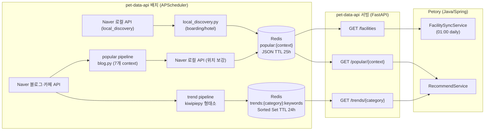

# pet-data-api 아키텍처

> 코드 기준: dev 브랜치 2026-05-25

---

## 1. 한 줄 정의

`pet-data-api`는 **추천 서버가 아니라 Popularity Intelligence API**다.

이 서버가 하는 일:
- 네이버 블로그·카페 데이터를 배치로 수집
- 트렌드 키워드 집계 (형태소 분석)
- 컨텍스트별 인기 상호 집계 (freshness 스코어링)
- Redis에 저장하고 HTTP로 노출

이 서버가 하지 않는 일:
- nearby 후보 반경 검색
- 사용자별 추천 랭킹
- 시설 마스터 정본 관리
- 추천 이벤트 수집·학습

---

## 2. 설계 배경 — 왜 이 경계를 선택했는가

초기 설계에서는 두 가지 다른 문제가 한 서버에 섞여 있었다.

1. **외부 비정형 데이터에서 "요즘 뭐가 인기 있는가" 추출** — 블로그 스크래핑·형태소 분석
2. **사용자 위치 기준으로 "지금 보여줄 후보를 뽑는" 일** — 반경 쿼리·시설 마스터

이 두 책임이 섞이면 다음 문제가 생긴다:

- `blog.py`가 regex + blocklist로 상호명을 뽑으면서 사실상 "후보 생성기"가 된다
- `location.py`가 그 결과에 Naver Local 위치를 붙이면서 두 번째 후보 생성 단계가 된다
- 추천 품질이 비정형 데이터 파싱 품질에 종속된다
- regex `_BLOCKLIST_CONTAINS` 190개, suffix 패턴 수십 개가 계속 늘어난다

해결 원칙:

> **시설은 구조화 데이터(Petory DB)에서 뽑고, 블로그는 점수 보정에만 쓴다.**

`pet-data-api`는 popularity signal만 생성하고, nearby 후보 생성은 Petory가 직접 담당한다.

---

## 3. 현재 시스템 구조



핵심 불변식:
- 외부 I/O는 배치에서만 발생
- API 레이어는 Redis만 읽음 — `/readyz`가 Redis ping만 검사하는 이유

---

## 4. 파이프라인 A — 트렌드 (매일 18:00)

```
runner.run_trend_collection()
  └─ 12개 category × CATEGORY_KEYWORDS 쿼리 목록
     naver.collect_category_trends(category)
       → 블로그+카페 API (sort=sim, sort=date 이중 호출)
       → link 기준 중복 제거
     analyzer.aggregate_keywords(items)
       → kiwipiepy NNG/NNP 명사 추출
       → STOPWORDS 필터 (동물 일반명사·업종명·지역명 등)
       → Counter {keyword: mention_count}
     redis.save_trend(category, counts)
       → ZADD trends:{category}:keywords (score = mention_count)
       → TTL 24h
```

트렌드 카테고리 12개: `supplies` `snack` `food` `grooming` `hospital` `clothes` `pharmacy` `cafe` `pension` `restaurant` `boarding` `hotel`

---

## 5. 파이프라인 B — 인기 상호 (매일 18:10)

인기 컨텍스트 9개: `grooming` `hospital` `supplies` `pharmacy` `cafe` `pension` `restaurant` `boarding` `hotel`

두 파이프라인이 컨텍스트에 따라 분기한다 (`runner.py:_LOCAL_DISCOVERY_CONTEXTS`):

### 5.1 일반 7개 context — blog.py 추출

```
blog.collect_popular_for_context(context)
  → 블로그+카페 API (sort=sim)
  → _extract_candidates_from_text()
      hint 단어 포함 여부로 관련 없는 글 조기 스킵
      _SUFFIX_PATTERNS regex → suffix 앞 상호명 캡처
      _PREFIX_PATTERNS regex → prefix 뒤 상호명 캡처
      _is_valid_name 필터 (blocklist exact/contains, 지역명, 어미)
  → _compute_scores(aggregator, context)
      min_mention 이상만 포함 (context별 1~2건)
      freshness = max(0, 1 − age_days / 180)  # 180일 윈도우
      raw_score = mention_count × avg_freshness
      score = raw_score / max(raw_scores)      # 0~1 정규화
      freshness=0인 stale 항목 제외
      상위 20개

location.enrich_with_location(popular, context)
  → Naver 로컬 검색 "{name} {업종힌트}"
  → address, road_address, map_x, map_y, telephone 보강

redis SETEX popular:{context} TTL=25h
```

**freshness 설계 근거**: 180일 윈도우는 "오래된 블로그 후기가 현재 운영 상태를 반영하지 않을 수 있다"는 전제에서 출발. 6개월 이상 된 포스트는 score=0으로 처리해 자연스럽게 탈락한다.

### 5.2 boarding / hotel — local_discovery 2단계 파이프라인

boarding과 hotel은 블로그에서 상호명을 regex로 추출하기 어렵다. "위탁" "호텔링" 같은 키워드는 일반 글에서도 동사·명사로 쓰여 오검출이 많다.

```
local_discovery.collect_popular_local_discovery(context)
  1단계: Naver Local API → 구조화된 업소 목록 (이미 address/map_x/map_y 포함)
  2단계: 각 업소명으로 블로그 검색 → mention_count 검증
  → 위치정보가 이미 포함되어 있으므로 enrich_with_location 스킵
```

**분리 이유**: blog.py regex 방식은 상호명이 블로그 문장에 명시적으로 등장해야 동작한다. boarding/hotel은 "강아지 위탁 후기" 같은 형태로 업소명 없이 기술되는 경우가 많아, Local API로 후보를 먼저 발굴하고 블로그로 popularity를 검증하는 순서가 더 정확하다.

---

## 6. 서빙 레이어

모든 API는 Redis만 읽는다. DB 쿼리 없음.

### GET /trends/{category}

```python
redis.zrange("trends:{category}:keywords", 0, limit-1, desc=True, withscores=True)
# 키 없으면 503
```

유효 카테고리는 `CATEGORY_KEYWORDS.keys()` — 12개. 등록되지 않은 category는 404.

### GET /popular/{context}

```python
redis.get(f"popular:{context}")
# 별칭: snack/food/clothes → supplies
# 키 없으면 503
```

### GET /facilities (FacilitySyncService 연동용)

```python
# popular:* 전체 키 스캔
for context in _POPULAR_CONTEXTS:
    entries = json.loads(redis.get(f"popular:{context}"))
    for entry in entries:
        if not entry.get("road_address") and not entry.get("address"):
            continue  # address 없는 항목 제외
        # name + address 기준 중복 제거
        # map_x/map_y → lat/lng 변환 (int(map_x) / 10_000_000.0)
        # address → region_city, region_district 파싱
```

cursor 기반 페이징 (`cursor`, `limit` 파라미터). Petory `FacilitySyncService`가 01:00 daily로 전체 목록을 당겨가 `LocationService` DB에 적재한다.

---

## 7. Petory 연동 — Track A / Track B

Petory `RecommendService`는 context에 따라 두 경로를 탄다.

### Track A — Petory DB owner (8개 context)

`PETORY_OWNED_CONTEXTS = {"grooming", "hospital", "pharmacy", "cafe", "restaurant", "pension", "boarding", "hotel"}`

```
RecommendService.recommendWithPetoryCandidates()
  1. LocationServiceService.searchLocationServicesByLocation()
       → MySQL ST_Within 반경 10km 검색 → nearby 후보 최대 20개
  2. PetDataApiClient.fetchPopular(context)
       → GET /popular/{context} → blog signal
  3. PetDataApiClient.fetchTrends(context)
       → GET /trends/{category} → trend keywords
  4. mergeNearbyCandidates()
       → 이름 normalize + suffix stripping으로 fuzzy match
       → finalScore = distanceScore×0.55 + ratingScore×0.20 + reviewScore×0.15 + popularityScore×0.10
       → 상위 5개 반환
```

scoring 가중치 설계 근거:
- `distanceScore 0.55` — 반려동물 서비스는 이동 거리가 선택의 가장 큰 요인
- `ratingScore 0.20` — DB에 rating 데이터가 있을 때 품질 신호로 활용
- `reviewScore 0.15` — 리뷰 수 log 스케일 (log₁₀(reviewCount+1))
- `popularityScore 0.10` — 블로그 mention 기반 보정 (최대 10%)

### Track B — 레거시 proxy (4개 context)

`supplies`, `snack`, `food`, `clothes` — 구조화 시설 마스터가 없는 트렌드 중심 카테고리.

```
RecommendService.recommendWithLegacyProxy()
  → PetDataApiClient.recommend(request) → pet-data-api로 전체 위임
```

Track B가 Track A로 전환되지 않는 이유: `LocationService` DB에 이 카테고리 시설 데이터가 없다. 용품점·사료·옷은 공공데이터 커버리지가 약하고 FacilitySyncService도 이 컨텍스트를 수집하지 않는다.

---

## 8. 인게스천 루프 — FacilitySyncService 연동

```
매일 18:10  pet-data-api popular 배치
              → Redis popular:{context} 갱신

매일 01:00  Petory FacilitySyncScheduler
              → GET /facilities?cursor=0&limit=100 (cursor 순회)
              → isValid(): name/address 필수, lat/lng 필수, 폐업 제외
              → categoryLabel(): context → 한국어 category3 매핑
                  grooming→미용, hospital→동물병원, boarding→위탁관리, hotel→호텔 등
              → LocationService DB upsert (dataSource=PET_DATA_API)

사용자 요청  Petory RecommendService (Track A)
              → LocationService DB ST_Within 검색 → nearby 후보
              → GET /popular/{context}              → blog signal 조합
```

`location` 컬럼(POINT SRID 4326)은 BEFORE INSERT 트리거로 `latitude`/`longitude`에서 자동 생성 (`ST_GeomFromText('POINT(lat lng)', 4326)`). Hibernate가 spatial 컬럼을 INSERT에서 누락하는 문제를 트리거로 우회.

---

## 9. 현재 한계와 다음 단계

### 현재 한계

**blog.py 7개 context의 오검출 문제**

`_BLOCKLIST_CONTAINS` 190개, suffix 패턴 수십 개가 누적되어 있다. 이미 복잡해진 상태이며 패턴 추가로는 근본적으로 해결되지 않는다. boarding/hotel에서 검증된 "Local API 후보 → blog verify" 패턴을 7개 context에도 확장하면 regex 의존도를 낮출 수 있다.

**Track B의 구조적 한계**

supplies/snack/food/clothes는 `PetDataApiClient.recommend()`를 통해 pet-data-api에 전체를 위임하지만, pet-data-api에서 POST /recommend는 실질적으로 popularity + trend 조합만 반환한다. 시설 마스터 없이 블로그 신호만으로 추천하는 한계가 있다.

### 다음 단계

| 단계 | 내용 | 우선순위 |
|------|------|---------|
| blog.py → local_discovery 전환 | `_LOCAL_DISCOVERY_CONTEXTS`를 7개로 확장, regex blocklist 단계적 제거 | 중 |
| Track B 착수 조건 정의 | supplies 등 카테고리의 구조화 시설 마스터 확보 방안 결정 | 저 |

---

## 10. 관련 문서

| 문서 | 내용 |
|------|------|
| [`DATA-AND-API-FLOW.md`](DATA-AND-API-FLOW.md) | 파이프라인 A/B 상세 흐름, mermaid 다이어그램 |
| [`PETORY-INTEGRATION.md`](PETORY-INTEGRATION.md) | Petory 클라이언트 연동 가이드, 에러 패턴 |
| [`04-petory-nearby-signal-architecture-redesign.md`](04-petory-nearby-signal-architecture-redesign.md) | Petory 책임 경계 재정의 분석 |
| [`05-petory-backend-changes.md`](05-petory-backend-changes.md) | Petory 백엔드 변경 사항 체크리스트 |
| [`PROJECT-OVERVIEW.md`](PROJECT-OVERVIEW.md) | 빠른 진입용 프로젝트 개요 |
