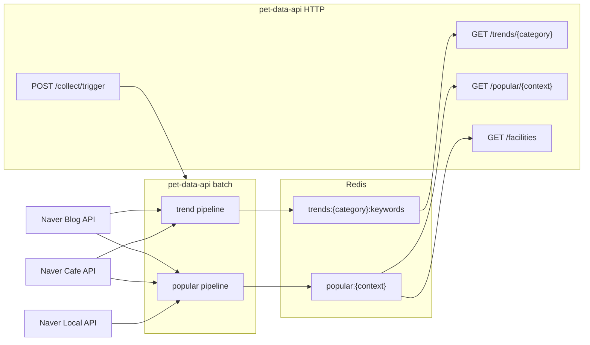
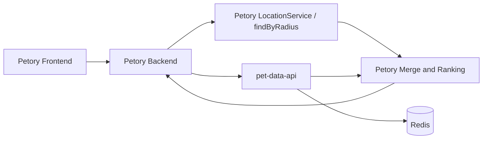

# pet-data-api 아키텍처

> 2026-05-24 기준. 현재 레포의 **실제 역할**과 Petory 연동 방향을 함께 설명한다.

## 1. 한 줄 정의

`pet-data-api`는 **추천 서버가 아니라 Popularity Intelligence API**다.

이 서버가 하는 일:

- 네이버 블로그/카페 데이터를 배치로 수집
- 트렌드 키워드 집계
- 컨텍스트별 인기 상호 집계
- Redis에 저장
- HTTP는 Redis만 읽어서 응답

이 서버가 하지 않는 일:

- nearby 후보 반경 검색
- 사용자별 추천 랭킹
- 시설 마스터 정본 관리
- 추천 이벤트 수집/학습 파이프

즉 이 레포의 책임은 **외부 시그널 생성과 서빙**까지다.

---

## 2. 왜 이렇게 정리했는가

이전 설계에서는 서로 다른 두 문제가 한 서버에 섞여 있었다.

1. 외부 비정형 데이터에서 "요즘 뭐가 인기 있는가"를 수집하는 문제
2. 사용자 위치 기준으로 "지금 보여줄 nearby 후보를 뽑는 문제"

현재 코드를 보면 이 경계가 흐려져 있다.

- `blog.py`는 regex + blocklist로 상호명을 뽑는다
- `location.py`는 인기 상호에 다시 Naver Local 위치를 붙인다
- `local_discovery.py`는 `boarding/hotel`에 대해 Local API로 후보를 먼저 발굴한 뒤 블로그로 검증한다

이 구조는 단기적으로는 동작할 수 있지만, 장기적으로는 아래 문제가 생긴다.

- 후보 생성과 인기 시그널 생성이 섞인다
- regex/blocklist 유지비가 커진다
- 구조화 시설 마스터 없이 비정형 데이터에 후보 품질이 종속된다
- 추천 책임 경계가 흐려진다

그래서 현재 아키텍처의 핵심 원칙은 다음이다.

> **시설은 구조화 데이터에서 뽑고, 블로그는 점수 보정에만 쓴다.**

---

## 3. 현재 시스템 구조



핵심:

- 외부 I/O는 배치에서만 발생
- API 라우터는 Redis만 읽음
- Redis가 이 서버의 유일한 운영 저장소

---

## 4. 실행 흐름

### 4.1 트렌드 파이프

1. `runner.run_trend_collection()`
2. `naver.collect_category_trends(category)`
3. 블로그/카페 결과를 link 기준 dedupe
4. `analyzer/trend.aggregate_keywords(...)`
5. Redis `trends:{category}:keywords` 저장

### 4.2 인기 상호 파이프

1. `runner.run_popular_collection()`
2. 일반 context:
   - `blog.collect_popular_for_context(context)`
   - regex 기반 상호명 추출
   - freshness score 계산
   - `location.enrich_with_location(...)`
3. `boarding/hotel`:
   - `local_discovery.collect_popular_local_discovery(context)`
   - Local API로 후보 발견
   - 블로그로 mention 검증
4. Redis `popular:{context}` 저장

### 4.3 서빙

1. `GET /trends/{category}` -> Redis Sorted Set 조회
2. `GET /popular/{context}` -> Redis JSON 조회
3. 키가 없으면 503

---

## 5. 현재 코드의 구조적 한계

### 5.1 `local_discovery`만의 문제가 아니다

문제 범위는 `boarding/hotel`에 국한되지 않는다.

- `boarding/hotel`은 `local_discovery` 사용
- 나머지 7개 context는 `blog.py` regex 추출 + `enrich_with_location()` 사용

즉 인기 파이프 전체가 아래 두 형태로 후보 비슷한 일을 하고 있다.

1. Local discovery -> Blog verify
2. Blog regex extract -> Local location enrich

둘 다 공통적으로:

- 구조화 마스터 대신 검색 API에 후보 품질이 의존
- 후처리 규칙이 계속 늘어남
- popularity signal provider가 후보 생성기처럼 동작

### 5.2 `blog.py`는 이미 확장 한계 신호를 보인다

실제 코드에는 다음이 동시에 존재한다.

- context별 suffix/prefix regex 다수
- 대규모 `_BLOCKLIST_EXACT`
- 대규모 `_BLOCKLIST_CONTAINS`
- 대규모 `_LOCATION_CITY`
- 조사/어미/지명 복합어 제거 규칙

즉 "나중에 복잡해질 것"이 아니라, **이미 복잡해진 상태**다.

이건 패턴을 조금 더 추가해서 해결할 문제가 아니라,  
상호명 추출 기반 후보 생성 전략의 유지비가 이미 높다는 신호다.

---

## 6. Petory와의 책임 경계

현재 Petory는 `/api/recommend`를 유지하지만, 실제로는 `pet-data-api`의 `popular/trends`를 받아 레거시 추천 DTO로 재조립하고 있다.

중요한 사실:

- Petory에는 이미 `findByRadius(...)` 기반 nearby 반경 검색이 있다
- `LocationServiceService.searchLocationServicesByLocation(...)`도 이미 작동한다
- 그런데 `RecommendService`는 그 경로를 쓰지 않고 `petDataApiClient.recommend(...)`에 위임한다

즉 문제는 인프라 부재가 아니라 **책임 연결이 안 되어 있는 것**이다.

목표 책임 분리는 다음과 같다.

### `pet-data-api`

- 인기 시그널 생성
- 트렌드 시그널 생성
- Redis 서빙

### `Petory`

- nearby 후보 생성
- 카테고리/거리/속성 필터링
- `popular/trends` 시그널 조합
- 최종 정렬
- 사용자 응답 조립



---

## 7. 컨텍스트를 같은 트랙으로 다루면 안 된다

모든 context를 같은 전환 계획으로 묶으면 안 된다.

### Track A: Petory owner 전환 완료 또는 진행 중인 컨텍스트

- `grooming`
- `hospital`
- `pharmacy`
- `cafe`
- `restaurant`
- `pension`
- `boarding` (2026-05-25 전환 완료 — 87개 시설 적재)
- `hotel` (2026-05-25 전환 완료 — 87개 시설 포함)

이 트랙은 공공데이터 또는 기존 `LocationService` 기반으로 nearby 후보를 만들 수 있다.  
즉 `findByRadius + popular/trends 조합`으로 추천이 동작한다.

### Track B: 비-시설 카테고리 (트렌드 중심)

- `supplies`, `snack`, `food`, `clothes`

이 트랙은 구조화 시설 마스터가 없는 트렌드 중심 카테고리다.

이유:

- 공공데이터 커버리지가 없거나 매우 약함
- `findByRadius` 후보가 없어 Petory owner 전환 대상이 아님
- 기존 `PetDataApiClient.recommend()` 레거시 경로 유지

`boarding/hotel`은 **2026-05-25 기준 Track A로 전환 완료**:

- `GET /facilities` 엔드포인트 구현으로 FacilitySyncService 경로 복구
- 87개 시설 Petory `LocationService` DB 적재 확인
- `PETORY_OWNED_CONTEXTS`에 `boarding`, `hotel` 추가
- petory-nearby-v1 경로로 추천 전환 완료

---

## 8. 지금 기준의 실행 결론

### 지금 유지할 것

- `GET /popular/{context}`
- `GET /trends/{category}`
- `GET /facilities` (FacilitySyncService 연동용, cursor 기반 페이징)
- 현재 배치/Redis 구조
- `boarding/hotel`의 `local_discovery` (인기 시그널 원천)

### 지금 Petory에서 바꿔야 할 것

Track A에 대해:

1. `RecommendService`가 nearby 후보를 직접 조회
2. `PetDataApiClient`는 `popular`, `trends`만 제공
3. Petory가 이름 매칭으로 popularity score를 주입
4. Petory가 정렬과 응답 조립을 수행

### 지금 바꾸면 안 되는 것

- `supplies/snack/food/clothes` Track B 레거시 경로 제거 (데이터 미확보)
- popularity API를 facility master처럼 다시 확장하는 것

---

## 9. 단계별 실행안

### Phase 0. 검증

먼저 확인할 것:

1. context별 `locationservice` 후보 수
2. lat/lng 완전성
3. 지역 커버리지
4. `popular` 조인율

대표 확인 쿼리:

```sql
SELECT category3, COUNT(*)
FROM locationservice
WHERE is_deleted = 0
GROUP BY category3
ORDER BY COUNT(*) DESC;
```

특히 `boarding/hotel`은 다음 전제로 본다.

- 거의 없거나 0건일 가능성이 높다
- `FacilitySyncService`는 현재 고장 상태다
- 따라서 fallback 유지 또는 별도 적재 파이프 보강 중 하나를 먼저 정해야 한다

### Phase 1. Track A 전환

- `pet-data-api`는 지금처럼 둔다
- Petory `RecommendService`를 Track A 기준으로 리팩터링한다
- `findByRadius` 경로를 recommendation에 연결한다
- `popular/trends`를 보조 시그널로만 사용한다

### Phase 2. Petory 조합 검증

- `PetDataApiClient.recommend()` 의존 축소
- `fetchPopular`, `fetchTrends` 중심으로 역할 축소
- 조인율 로그 확인
- 정렬 결과 검증

이 단계는 기술적으로는 바로 가능하다.  
남은 변수는 데이터 커버리지와 조인율이다.

### Phase 3. 인기 파이프 축소

- Track A에서 `enrich_with_location()` 의존 줄이기
- `blog.py`가 후보 생성 비슷한 일을 맡는 범위를 줄이기
- popularity를 순수 시그널 provider에 가깝게 정리

### Track B (supplies/snack/food/clothes) 착수 조건

아래 중 하나가 먼저 정해져야 한다.

1. 해당 카테고리의 구조화 시설 마스터 확보
2. 트렌드 전용 응답 DTO 분리

**boarding/hotel은 2026-05-25 기준 Track A 전환 완료** — 별도 착수 조건 불필요.

---

## 10. 관련 문서

- [`README.md`](README.md)
- [`DATA-AND-API-FLOW.md`](DATA-AND-API-FLOW.md)
- [`codex-petory-nearby-recommendation-integration.md`](codex-petory-nearby-recommendation-integration.md)
- [`/Users/maknkkong/project/pet-data-api/docs/PETORY-INTEGRATION.md`](/Users/maknkkong/project/pet-data-api/docs/PETORY-INTEGRATION.md)

이 문서의 요지는 하나다.

> `pet-data-api`는 popularity intelligence로 남기고, Petory는 nearby candidate owner가 된다.  
> 단, `boarding/hotel`은 데이터 원천 문제 때문에 별도 트랙으로 다뤄야 한다.
