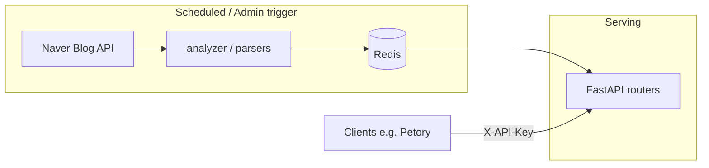

# 데이터 수집·API 조회 흐름

> 이 문서는 **현재 코드** 기준입니다. 상태 저장은 **Redis만** 사용합니다(PostgreSQL 없음).

## 한 장 요약

1. **수집(쓰기)** — 스케줄(매일 18:00 트렌드, 18:10 인기) 또는 **`POST /collect/trigger`** 가 `runner` 에서 네이버 블로그 검색 결과를 받아 가공 후 Redis 에 기록합니다.
2. **서빙(읽기)** — `GET /trends/{category}`, `GET /popular/{context}` 는 Redis 만 읽습니다. 블로그 API를 호출하지 않습니다.
3. **인증** — 조회와 일반 기능은 **`X-API-Key`** (일반 키 해시). 수동 수집은 **`ADMIN_API_KEY_HASH`** 에 맞는 키 필요.

## Redis 키 (개략)

| 용도 | 키·형태 |
|------|---------|
| 트렌드 키워드 순위 | `trends:{category}:keywords` (Redis Sorted Set — `save_trend` / `get_trend`) |
| 트렌드 갱신 시각 | `trends:{category}:updated_at` (문자열 ISO 시각, TTL 24h) |
| 인기 상호 목록 | `popular:{context}` — JSON 문자열 배열 `[{ name, mention_count, avg_freshness, score }, ...]` |

## 오류 동작

- Redis 미기동 또는 캐시에 데이터 없음 → `GET /trends/...`, `GET /popular/...` 는 **503** 과 짧은 `detail` 메시지를 반환할 수 있습니다.
- **`GET /readyz`** 는 **Redis ping** 만 검사합니다(데이터 존재 여부는 검사하지 않음).

## 관련 소스 위치

- 트렌드 수집: `run_trend_collection`, 네이버 쿼리 맵 — `app/ingestion/` (`naver.py`, `runner.py`)
- 인기 수집: `run_popular_collection` — `app/ingestion/runner.py`
- HTTP — `app/serving/api/trends.py`, `app/serving/api/popular.py`, `app/serving/api/collect.py`
