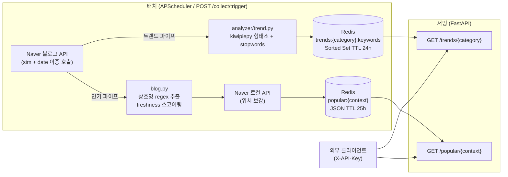

# 데이터 수집·API 조회 흐름

> 현재 코드(dev 브랜치) 기준. 저장소는 **Redis만** 사용 (PostgreSQL 없음).

---

## 한 장 요약



---

## 파이프라인 A — 트렌드 키워드

**목적:** 카테고리별로 많이 언급되는 반려동물 관련 키워드를 집계해 Redis Sorted Set으로 저장.

### 코드 흐름

```
runner.run_trend_collection()
  └─ for category in CATEGORY_KEYWORDS          # 12개 카테고리
       naver.collect_category_trends(category)
         └─ 각 쿼리 × (sim + date) 병렬 호출    # asyncio.gather, 세마포어 4
            link 기준 중복 제거 (seen set)
         → list[dict] (title, description, link, postdate, blogger_name, ...)
       analyzer/trend.aggregate_keywords(items)
         └─ morpheme.extract_nouns(title + description)
              kiwipiepy → NNG / NNP 명사 추출
              STOPWORDS 필터 (동물 일반명사, 업종명, 검색 메타어, 지역명 등)
         → Counter {keyword: count}
       cache/redis.save_trend(category, counts)
              pipeline: DELETE → ZADD → SETEX updated_at → EXPIRE
         → Redis Sorted Set (score = mention_count)
```

### 검색 쿼리 구성

`CATEGORY_KEYWORDS` (naver.py)에 카테고리별 쿼리 문자열 목록이 정의되어 있음.

| 카테고리 | 쿼리 예시 |
|---------|---------|
| grooming | "강아지 미용실 후기", "애견미용 잘하는 곳", ... (6개) |
| hospital | "동물병원 후기", "동물병원 잘하는 곳", ... (4개) |
| cafe | "반려동물 카페 추천", "애견카페 추천", ... (5개) |
| ... | (supplies, snack, food, clothes, pharmacy, pension, restaurant, boarding, hotel) |

각 쿼리에 `sort=sim` 과 `sort=date` 두 번 호출 → 최신 트렌드와 관련도 높은 글을 함께 반영.  
동일 `link` 는 첫 번째 결과만 사용 (중복 집계 방지).

### Redis 키

| 키 | 타입 | TTL | 내용 |
|----|------|-----|------|
| `trends:{category}:keywords` | Sorted Set | 24h | keyword → score(mention_count) |
| `trends:{category}:updated_at` | String | 24h | ISO 8601 갱신 시각 |

### 서빙

```
GET /trends/{category}?limit=N
  └─ redis.zrange(key, 0, N-1, desc=True, withscores=True)
     키 없으면 503
```

---

## 파이프라인 B — 인기 상호

**목적:** 블로그 포스트에서 상호명을 추출하고 freshness 스코어로 정규화해 Redis JSON으로 저장.

### 코드 흐름

```
runner.run_popular_collection()
  └─ for context in _POPULAR_CONTEXTS           # 9개 context
       # boarding/hotel: local_discovery 2단계 파이프라인
       # 나머지 7개 context: blog.py 추출
       if context in {"boarding", "hotel"}:
         local_discovery.collect_popular_local_discovery(context)
           └─ Naver Local API (후보 발견) → blog.py (언급 검증)
       else:
         blog.collect_popular_for_context(context)
         └─ blog.extract_popular_names(context)
              _CONTEXT_QUERIES[context] 쿼리 목록 순차 호출 (sort=sim)
              link 기준 전역 중복 제거
              for item in unique_items:
                text = title + description
                freshness = _parse_freshness(postdate)
                  → max(0, 1 - age_days / 180)   # 180일 창
                _extract_candidates_from_text(text, context)
                  → hint 단어 포함 여부로 관련 없는 글 조기 스킵
                  → _SUFFIX_PATTERNS regex (상호명+업종 suffix 캡처)
                  → _PREFIX_PATTERNS regex (업종 prefix+상호명 캡처)
                  → _is_valid_name 필터
                      _BLOCKLIST_EXACT (일반명사, 동작어 등)
                      _BLOCKLIST_CONTAINS (추천, 후기, 지명복합 등)
                      _LOCATION_CITY (광역·도시명 단독)
                      _LOCATION_SUFFIX regex (구/시/동/역 어미)
                      _GRAMMAR_ENDING regex (조사·어미 어말)
                aggregator[name]["count"] += 1
                aggregator[name]["freshness_sum"] += freshness
              _compute_scores(aggregator)
                  min 2건 이상만 포함
                  avg_freshness = freshness_sum / count
                  raw_score = count × avg_freshness
                  score = raw_score / max(raw_scores)  # 정규화
                  stale(freshness=0) 항목 제외
                  score 내림차순 상위 20개
         → list[dict] (name, mention_count, avg_freshness, score)
       # boarding/hotel은 위치정보가 local_discovery에 포함 → enrich 스킵
       location.enrich_with_location(popular, context)  # boarding/hotel 제외
         └─ for entry in popular:
              Naver 로컬 검색("{name} {업종힌트}", display=3) # 세마포어 3
              결과 중 상호명 포함 항목 우선, 없으면 첫 번째
              → address, road_address, map_x, map_y, telephone 보강
       blog.save_popular(context, enriched)
         → Redis SETEX popular:{context} TTL=25h JSON 배열
```

### Redis 키

| 키 | 타입 | TTL | 내용 |
|----|------|-----|------|
| `popular:{context}` | String (JSON) | 25h | `[{name, mention_count, avg_freshness, score, address?, road_address?, map_x?, map_y?, telephone?}]` |

### 컨텍스트 목록

`grooming`, `hospital`, `supplies`, `pharmacy`, `cafe`, `pension`, `restaurant`, `boarding`, `hotel`

별칭: `snack` / `food` / `clothes` → `supplies` (API 레벨에서 매핑)

### 서빙

```
GET /popular/{context}?limit=N
  └─ alias 해석 (snack → supplies 등)
     redis.get(f"popular:{context}")
     키 없으면 503
     JSON 파싱 후 상위 N개 반환
```

---

## 스케줄·수동 트리거

| 수단 | 시각/조건 | 실행 함수 |
|------|----------|---------|
| APScheduler (자동) | 매일 로컬 18:00 | `run_trend_collection` |
| APScheduler (자동) | 매일 로컬 18:10 | `run_popular_collection` |
| `POST /collect/trigger` (수동) | 관리자 X-API-Key | `{"targets":["trends","popular"]}` |

`max_instances=1` — 이전 실행이 끝나기 전에 다음 실행이 겹치지 않음.

---

## 오류 동작

| 상황 | 동작 |
|------|------|
| Redis 미기동 | `/readyz` 503, 트렌드/인기 쓰기 실패 |
| 배치 미실행 (키 없음) | `GET /trends/...`, `GET /popular/...` → **503** |
| Naver API 실패 | 해당 카테고리/컨텍스트만 `status: failed` 로 기록, 나머지 계속 진행 |
| 집계 결과 빈 경우 | `status: skipped_empty`, Redis 기존 키 유지 |
| 위치 보강 실패 | `address`·좌표 필드 `None`, 상호명 항목은 그대로 포함 |

---

## 관련 소스

| 파일 | 역할 |
|------|------|
| `app/ingestion/naver.py` | Naver 블로그·로컬 API 호출, CATEGORY_KEYWORDS, collect_category_trends |
| `app/ingestion/blog.py` | 인기 상호 추출·스코어링·저장 |
| `app/ingestion/location.py` | Naver 로컬 검색으로 위치 보강 |
| `app/ingestion/runner.py` | 배치 진입점 (run_trend_collection, run_popular_collection) |
| `app/ingestion/analyzer/trend.py` | aggregate_keywords |
| `app/ingestion/analyzer/morpheme.py` | kiwipiepy 형태소 분석, STOPWORDS |
| `app/platform/cache/redis.py` | save_trend, get_trend, Redis 키 상수 |
| `app/platform/scheduler/jobs.py` | APScheduler 스케줄 등록 |
| `app/serving/api/trends.py` | GET /trends/{category} |
| `app/serving/api/popular.py` | GET /popular/{context} |
| `app/serving/api/facilities.py` | GET /facilities (cursor 페이징, FacilitySyncService 연동) |
| `app/serving/api/collect.py` | POST /collect/trigger |
| `app/ingestion/local_discovery.py` | boarding/hotel Local discovery → Blog verify 2단계 |
